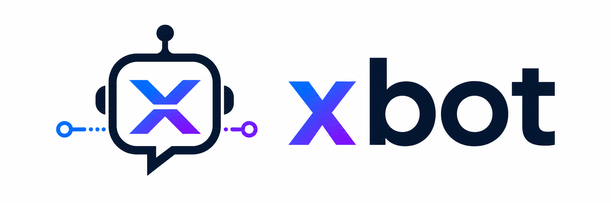
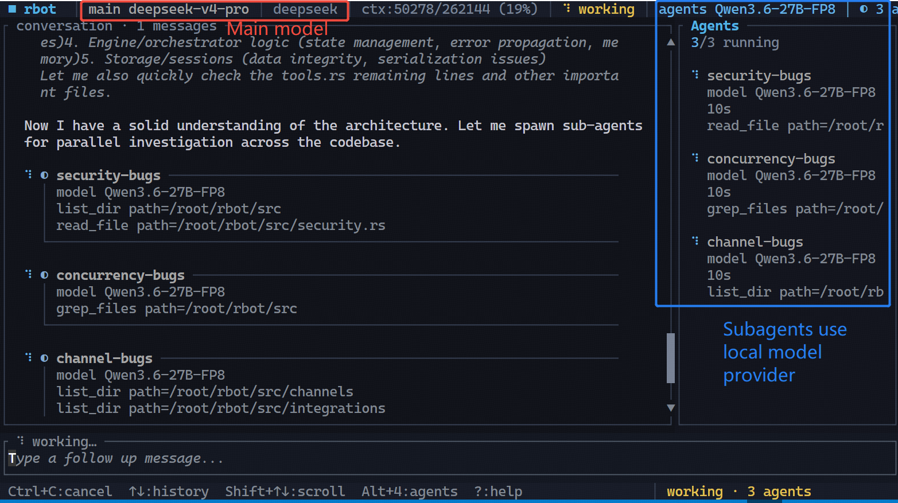

<div align="center">
  
  <p style="margin: 0;">
    Rust原生自主AI Agent运行时，面向持久化任务自动化、Vibe Coding、定时任务以及多渠道消息投递。🚀
  </p>
</div>

<p align="center">
  <a href="./README.md">English</a> |
  <a href="./README-CN.md">简体中文</a> |
</p>

## ✨ 功能特性

- 🧠 **持久化 Agent 运行时** - 长时间运行的 Agent 运行时，支持持久会话、按会话序列化以及可配置的并发控制
- 📝 **永久记忆捕获** - 由 LLM 驱动的记忆整合、自动任务摘要、显式 `/memorize` 支持，以及与主题相关的记忆检索
- 🛠️ **丰富工具集** - 文件系统、Shell、网页抓取、网页搜索、消息、cron 和后台任务工具
- 🌐 **Provider 集成** - 支持 OpenAI 兼容接口、Anthropic、GitHub Copilot（OAuth）、Cursor 以及本地引擎
- 🧵 **混合模型路由** - 在 DeepSeek `deepseek-v4-pro` 等远程前沿 API 上运行主任务，同时让后台子 Agent 使用本地 Qwen/vLLM/Ollama 模型进行快速并行工作
- 🔌 **MCP 支持** - 集成 MCP stdio 工具，用于连接外部工具服务器
- 🧩 **内置技能** - 软件工程、研究/报告、GitHub/CI、定时运维、记忆管理、cron 以及 clawhub marketplace
- 📬 **多渠道** - 13 种渠道后端：`email`、`slack`、`telegram`、`feishu`、`dingtalk`、`discord`、`matrix`、`whatsapp`、`qq`、`wecom`、`weixin`、`mochat`，以及可扩展的插件渠道
- 🌐 **网关进程** - Webhook 入口、健康检查、就绪检查、Prometheus 指标和 Web 管理界面
- 🔄 **流式输出** - 支持流式 delta，提供按渠道流式输出、重试逻辑和指数退避
- 🪝 **Hook 系统** - 可扩展的 `AgentHook` trait，用于在不修改核心 Agent 循环的情况下添加生命周期回调

## 概览（混合模型路由）


截图展示了 `xbot` 的核心优势之一：主 Agent 可以使用远程高能力模型，而子 Agent 可以分发到独立的本地模型上。这让你可以把付费远程 token 留给综合与高难推理，同时把本地 GPU 算力用于并行探索、代码阅读、测试和报告收集。

## 📚 文档

- [🚀 入门指南](./docs/USAGE.md)
- [📦 安装](./docs/INSTALLATION.md)
- [🧵 远程主模型 + 本地子 Agent 混合模式](./docs/HYBRID_MODELS.md)
- [🏗️ 架构](./docs/ARCHITECTURE.md)
- [⚙️ 运维指南](./docs/OPERATIONS.md)

## ⚡ 快速开始

### 安装 xbot：

```bash
npm install -g @trusted-ai/xbot
# 或 cargo install xbot
# 或从 GitHub Releases 安装 .deb 包
# 或从源代码编译安装
cargo install --path .
```

安装后的命令为 `xbot`。详情请参阅[安装](./docs/INSTALLATION.md)。

### 初始化配置和工作区：

```bash
xbot onboard
```

这将生成：

```python
# 全局配置文件
Config: ~/.xbot/config.json
# 全局工作区
Workspace: ~/.xbot/workspace
```

### 配置 Provider

`xbot` 同时支持远程和本地 OpenAI 兼容后端。🎯
你可以通过交互方式配置：

```bash
xbot config --provider
```

也可以手动编辑 `~/.xbot/config.json`。请参考：[入门指南](./docs/USAGE.md)

对于推荐的混合配置，可使用 DeepSeek `deepseek-v4-pro` 等远程主模型，以及运行 Qwen 的 vLLM 等本地 OpenAI 兼容服务器作为子 Agent 后端。请参阅[远程主模型 + 本地子 Agent 混合模式](./docs/HYBRID_MODELS.md)。

### 配置通信渠道

在启动后端之前，你应该配置首选通信渠道（Slack、Telegram 等），以启用消息入口和投递。📬

使用交互式配置工具：

```bash
xbot config --channel
```

列出、配置并登录渠道：

```bash
xbot channels list          # 列出所有可用渠道
xbot channels status        # 显示启用/禁用状态
xbot channels setup discord # 设置说明（如何获取 token）
xbot channels login weixin  # 交互式登录（扫码）
```

使用 `channels setup <name>` 查看任意渠道获取所需 token 和 key 的分步说明。对于支持交互登录的渠道（微信扫码、WhatsApp bridge），使用 `channels login`。如需手动配置或查看详细渠道选项，请参阅[入门指南](./docs/USAGE.md#5-channel-configuration)。

> [!TIP]
> **Slack 用户：** 为 Agent 设置 Slack App：[Slack 手册](https://www.meta-intelligence.tech/en/insight-openclaw-slack)。
> **Telegram 用户：** 为 Agent 设置 Telegram App：[Telegram 手册](https://www.meta-intelligence.tech/en/insight-openclaw-telegram)。


## 🧾 使用

## CLI 使用

在 CLI 模式下，xbot 默认在当前文件夹中工作；添加 `--workspace` 参数可为 xbot 指定工作目录。

### 一次性提示词：

```bash
# 这会扫描并初始化项目，以供后续任务使用（XBOT.md）
xbot chat /init
# xbot chat /init --workspace ANOTHER_PROJECT_PATH
# 这会一次执行一个任务
xbot chat "find bugs in this project"
```

### 交互式 Shell（TUI，富终端界面）：

```bash
xbot repl
# xbot repl --workspace ANOTHER_PROJECT_PATH
```

CLI 包含：
- 📡 流式响应
- 📜 持久历史记录
- 💻 本地 Shell 命令，例如 `/help` 和 `/clear`
- 🤖 Agent 命令，例如 `/new`、`/clear`、`/memorize <text>`、`/status`、`/init` 和 `/stop`

`chat` 和 `repl` 默认使用当前目录作为工作区，并在其中创建 `.xbot/`。使用 `xbot repl --global` 或 `xbot chat --global "..."` 可使用已配置的全局工作区，也可以使用 `--workspace <path>` 指定显式工作区。

### 管理技能：

```bash
xbot skills list
xbot skills init my-custom-skill
```

## ⚡ 后端机器人
### 启动后端（个人 AI 助手）：

```bash
xbot run
```

`run` 默认使用已配置的全局工作区。当后端需要针对当前项目工作区运行时，使用 `xbot run --workspace .`。

通过已配置的渠道（例如 Slack App）向 `xbot` 发送任务。

### 检查运行时配置和本地状态：

```bash
xbot status
xbot sessions
xbot jobs
xbot channels status
xbot skills list
```

## 📡 运行时入口

### 渠道后端

- 📧 **email**：IMAP 轮询 + SMTP 发送
- 💬 **slack**：Socket Mode 或 webhook 入口 + 发送
- ✈️ **telegram**：webhook 入口 + 发送
- 🦘 **feishu**：webhook 入口 + 发送，包括入站媒体/资源处理
- 🔔 **dingtalk**：Stream gateway WebSocket + REST 发送
- 🎮 **discord**：Gateway v10 WebSocket + REST 发送
- 🏠 **matrix**：CS API v3 长轮询同步 + 发送
- 📱 **whatsapp**：连接 Node.js Baileys 的 WebSocket bridge
- 🐧 **qq**：QQ Bot API WebSocket gateway + REST 发送
- 🏢 **wecom**：企业微信 AI Bot WebSocket
- 💬 **weixin**：个人微信，通过 HTTP 长轮询
- 🌐 **mochat**：HTTP 轮询，支持 session/panel
- 🔌 **mcp**：基于 stdio 的外部工具服务器，以原生工具形式暴露

### 渠道命令

通过 Slack、Telegram 或其他渠道与机器人通信时，你可以将以下信号作为独立消息发送：

- `stop` 或 `/stop` - 立即停止当前 Agent 任务并取消正在运行的子 Agent。
- `clear`、`new`、`/clear` 或 `/new` - 开始新会话，并将 `.xbot/memory/HISTORY.md` 恢复为默认模板。
- `memorize <text>` 或 `/memorize <text>` - 通过 `memory-entry-writer` 摘要技能，将用户指令型持久记忆存储到 `.xbot/memory/MEMORY.md`。
- `status` 或 `/status` - 获取当前版本和运行时使用统计。
- `help` 或 `/help` - 显示可用命令。

### 网关端点

网关提供：

- ✅ `GET /healthz` - 健康检查
- 🟢 `GET /readyz` - 就绪检查
- 📊 `GET /status` - 运行时状态
- 📈 `GET /metrics` - Prometheus 指标
- 🎛️ `GET /admin` - Web 管理界面
- 🔧 `GET /api/admin/*` - 管理 API

## ✅ 验证

```bash
cargo fmt
cargo test
```

## 🎯 使用场景

- 🤖 **个人 AI 助手** - 跨通信渠道的常驻 AI 助手
- 📊 **自动化监控** - 定时任务和基于 webhook 的监控
- 🔧 **DevOps 自动化** - 工具执行、文件操作和系统管理
- 📝 **研究与报告** - 网页搜索、分析和报告生成
- 🔄 **CI/CD 集成** - GitHub/CI 自动化和状态更新

---

**使用 Rust 倾情构建** 🦀
