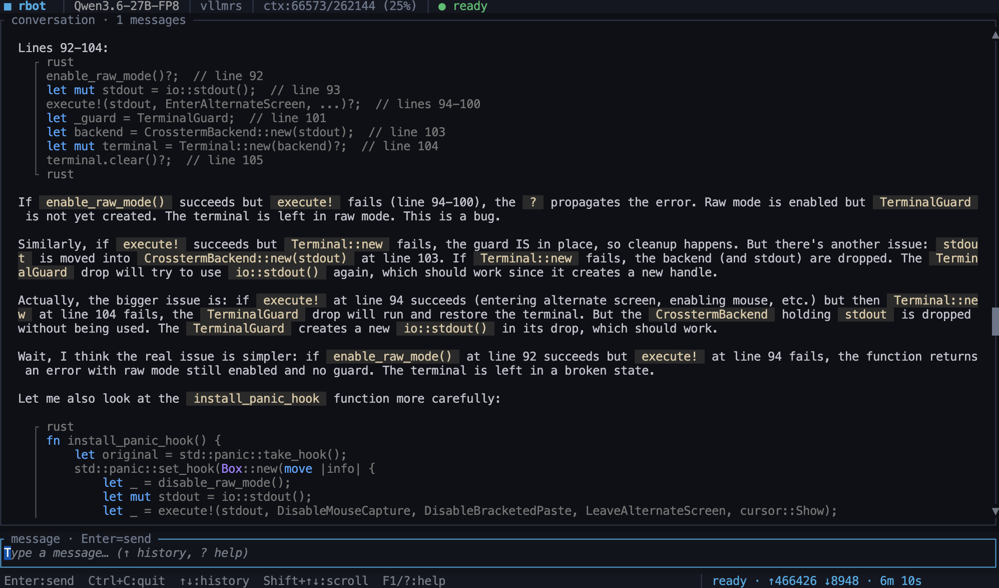

# 🤖 rbot: A Minimal AI Agent in Rust for Automation and Development

`rbot` is a Rust-native autonomous bot runtime for persistent chat automation, tool execution, scheduled work, and multi-channel message delivery. 🚀

## ✨ Features

- 🧠 **Persistent Agent Runtime** - Long-running agent runtime with persistent sessions, per-session serialization, and configurable concurrency control
- 📝 **Permanent Memory Capture** - LLM-driven memory consolidation, automatic task summaries, explicit `/memorize` support, and topic-relevant memory lookup
- 🛠️ **Rich Toolset** - Filesystem, shell, web fetch, web search, messaging, cron, and background-task tools
- 🌐 **Provider Integration** - OpenAI-compatible, Anthropic, GitHub Copilot (OAuth), Cursor, and local engines
- 🔌 **MCP Support** - MCP stdio tool integration for external tool servers
- 🧩 **Built-in Skills** - Software engineering, research/reporting, GitHub/CI, scheduled operations, memory management, cron, and clawhub marketplace
- 📬 **Multi-Channel** - 13 channel backends: `email`, `slack`, `telegram`, `feishu`, `dingtalk`, `discord`, `matrix`, `whatsapp`, `qq`, `wecom`, `weixin`, `mochat`, and extensible plugin channels
- 🌐 **Gateway Process** - Webhook ingress, health checks, readiness checks, Prometheus metrics, and a web admin UI
- 🔄 **Streaming** - Stream delta support with per-channel streaming, retry logic with exponential backoff
- 🪝 **Hook System** - Extensible `AgentHook` trait for lifecycle callbacks without modifying the core agent loop

## Overview


## 📚 Documentation

- [🚀 Getting Started](./docs/USAGE.md)
- [🏗️ Architecture](./docs/ARCHITECTURE.md)
- [⚙️ Operations Guide](./docs/OPERATIONS.md)

## ⚡ Quick Start

### Initialize config and workspace:

```bash
cargo run --release -- onboard
```

This will generate:

```python
# Global config file
Config: ~/.rbot/config.json
# Global workspace
Workspace: ~/.rbot/workspace
```

### Config Providers

`rbot` supports both remote and local OpenAI-compatible backends. 🎯
You can configure them interactively:

```bash
cargo run --release -- config --provider
```

Or manually edit `~/.rbot/config.json`. Refer to: [Getting Started](./docs/USAGE.md)

### Config Communication Channels

Before starting the backend, you should configure your preferred communication channels (Slack, Telegram, etc.) to enable message ingress and delivery. 📬

Use the interactive configuration tool:

```bash
cargo run --release -- config --channel
```

List, configure, and log in to channels:

```bash
cargo run --release -- channels list          # List all available channels
cargo run --release -- channels status        # Show enabled/disabled state
cargo run --release -- channels setup discord # Setup instructions (how to get tokens)
cargo run --release -- channels login weixin  # Interactive login (QR code scan)
```

Use `channels setup <name>` to see step-by-step instructions for obtaining the required tokens and keys for any channel. For channels that support interactive login (Weixin QR code, WhatsApp bridge), use `channels login`. For manual configuration or detailed channel options, see [Getting Started](./docs/USAGE.md#5-channel-configuration).

> [!TIP]
> **Slack Users:** Set up Slack App for Agents [Slack Manual](https://www.meta-intelligence.tech/en/insight-openclaw-slack).
> **Telegram Users:** Set up Telegram App for Agents [Telegram Manual](https://www.meta-intelligence.tech/en/insight-openclaw-telegram).


## 🧾Usage

## CLI usage

### One-shot prompt:

```bash
cargo run --release -- chat "summarize the repository structure"
```

### Interactive shell:

```bash
cargo run --release -- repl
```

The CLI includes:
- 📡 Streamed responses
- 📜 Persistent history
- 💻 Local shell commands such as `/help` and `/clear`
- 🤖 Agent commands such as `/new`, `/clear`, `/memorize <text>`, `/status`, and `/stop`

### Manage skills:

```bash
cargo run --release -- skills list
cargo run --release -- skills init my-custom-skill
```

## ⚡ Backend Bot
### Start the backend (Personal AI Assistant):

```bash
cargo run --release -- run
```

Sending task(s) to `rbot` using configured channels (such as Slack APP).

### Check runtime configuration and local state:

```bash
cargo run --release -- status
cargo run --release -- sessions
cargo run --release -- jobs
cargo run --release -- channels status
cargo run --release -- skills list
```

## 📡 Runtime Surfaces

### Channel Backends

- 📧 **email**: IMAP polling + SMTP send
- 💬 **slack**: Socket Mode or webhook ingress + send
- ✈️ **telegram**: webhook ingress + send
- 🦘 **feishu**: webhook ingress + send, including inbound media/resource handling
- 🔔 **dingtalk**: Stream gateway WebSocket + REST send
- 🎮 **discord**: Gateway v10 WebSocket + REST send
- 🏠 **matrix**: CS API v3 long-poll sync + send
- 📱 **whatsapp**: WebSocket bridge to Node.js Baileys
- 🐧 **qq**: QQ Bot API WebSocket gateway + REST send
- 🏢 **wecom**: Enterprise WeChat AI Bot WebSocket
- 💬 **weixin**: Personal WeChat via HTTP long-poll
- 🌐 **mochat**: HTTP polling with session/panel support
- 🔌 **mcp**: stdio-based external tool servers exposed as native tools

### Channel Commands

When messaging the bot through Slack, Telegram, or other channels, you can send these signals as standalone messages:

- `stop` or `/stop` - Immediately stop the current agent task and cancel running subagents.
- `clear`, `new`, `/clear`, or `/new` - Start a new session and restore `.rbot/memory/HISTORY.md` to the default template.
- `memorize <text>` or `/memorize <text>` - Store durable user-directed memory in `.rbot/memory/MEMORY.md` through the `memory-entry-writer` summarization skill.
- `status` or `/status` - Get the current version and runtime usage stats.
- `help` or `/help` - Show available commands.

### Gateway Endpoints

The gateway exposes:

- ✅ `GET /healthz` - Health check
- 🟢 `GET /readyz` - Readiness check
- 📊 `GET /status` - Runtime status
- 📈 `GET /metrics` - Prometheus metrics
- 🎛️ `GET /admin` - Web admin UI
- 🔧 `GET /api/admin/*` - Admin API

## ✅ Verification

```bash
cargo fmt
cargo test
```

## 🎯 Use Cases

- 🤖 **Personal AI Assistant** - Always-on AI assistant across your communication channels
- 📊 **Automated Monitoring** - Scheduled tasks and webhook-based monitoring
- 🔧 **DevOps Automation** - Tool execution, file operations, and system management
- 📝 **Research & Reporting** - Web search, analysis, and report generation
- 🔄 **CI/CD Integration** - GitHub/CI automation and status updates

---

**Built with ❤️ in Rust** 🦀
